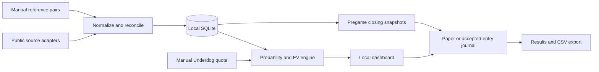

# NFL Edge — full project plan and independent review brief

**Prepared:** September 15, 2026

**Version:** 1.0 — design for review, with prototype status

**Owner:** Individual user in South Carolina

**Purpose:** Provide enough context for an independent reviewer to critique the product, data strategy, mathematics, architecture, and implementation sequence without reading the original conversation.

---

## Instructions for the reviewing model

Please act as an independent reviewer with expertise in sports-market pricing, event contracts, data engineering, and application reliability. Review the entire plan before recommending changes.

The objective is a personal, local NFL price-research application that evaluates manually entered Underdog quotes using free public reference data. A working prototype exists, but there is no demonstrated profitable strategy. Treat the implementation-status section as an account of observed work, not an independent code audit.

Please return:

1. An executive verdict: feasible, feasible with changes, or not feasible under the stated constraints. Distinguish a useful research tool from a validated money-making strategy.
2. The ten most consequential weaknesses, ranked by severity and likelihood of creating false positive EV estimates.
3. A mathematical review, with corrected formulas and numerical counterexamples where appropriate.
4. A source-by-source data assessment: market coverage, independence, latency, access reliability, and suitability as a probability benchmark.
5. A prioritized change list: P0 before relying on outputs, P1 before a paper pilot, and P2 after the pilot.
6. A revised implementation sequence with concrete acceptance criteria.
7. Answers to the review questions in Section 19.
8. A short list of evidence or user information genuinely missing from this plan.

Verify time-sensitive claims using current primary sources. Separate verified facts, plausible inferences, and proposals. Do not assume a free endpoint is permitted for unlimited collection, that three sportsbooks are statistically independent, that a median is the true probability, or that passing tests proves positive expected returns. Do not substitute paid feeds, hosted infrastructure, automatic wagering, or a different betting venue without explaining why the original constraints cannot be met.

The reviewer is being asked for feedback, not permission to place bets or change any external account.

---

## 1. Objective and feasibility position

Build **NFL Edge**, a personal dashboard inspired by the odds-comparison workflow of OddsTrader. It will answer:

> Given this exact NFL selection and the total cost and payout currently shown in Underdog, does available market evidence suggest a positive expected return after fees, and how credible is that estimate?

The product has three distinct jobs:

1. Collect and compare reference prices for the same event and outcome.
2. Evaluate the user's actual Underdog quote under explicit payout and probability assumptions.
3. Preserve evidence and results so the user can evaluate the process over time.

**Current feasibility assessment:** building the local research tool is feasible and already underway. Reliably identifying executable positive-EV opportunities with the current free sources remains unproven. The present automated feeds alone do not meet the proposed three-eligible-book screen.

Because Underdog quotes are entered manually, the initial release is a **reference board plus quote evaluator**. It cannot continuously scan the entire Underdog board or discover every available opportunity. Automatic target-price acquisition would be a separate feasibility milestone.

There is no promised win rate, profit rate, daily income, number of bets, or return on bankroll. A correct system may return zero qualifying candidates.

## 2. User requirements and design boundaries

| Area | Requirement or initial decision |
|---|---|
| Sport | NFL |
| Markets | Pregame, full-game moneyline, spread, and combined point total |
| Placement | User manually enters positions through Underdog |
| Physical location | South Carolina |
| Underdog product | Design assumes Prediction Picks for team markets; verify the actual product and market in the user's app |
| Deployment | This Windows computer only; no public hosting |
| Data | Build our own collectors using free public sources; no paid odds-feed dependency |
| Target quotes | Manual Underdog cost/payout entry is acceptable for the first version |
| Probability approach | Reference-market prices initially; no independent NFL prediction model |
| Bankroll | User supplies the amount; begin with no invented balance |
| Sizing | Proposed fixed-fraction defaults, with per-game and aggregate open-exposure limits |
| Records | Separate paper entries and actually accepted bets |
| Inspiration | Odds comparison and evidence visibility, rather than copying another site's content or design |

### Initial release includes

- Read-only public collection, normalized references, source health, and timestamps.
- Exact-line comparison and transparent probability estimates.
- Fee-aware EV calculations and explicit reasons a quote does not pass the screen.
- Manual reference-pair entry to supplement automated coverage.
- Bankroll settings, exposure tracking, journal, settlement corrections, CSV export, and qualified/indicative closing comparisons.

### Deferred scope

Live betting, player props, parlays/combos, arbitrage execution, promotion conversion, automatic wagering, account funding, credential storage, other betting venues, public subscriptions, machine-learning predictions, notifications outside the running local app, and cloud hosting.

Historical NFL statistics, injuries, weather, and news are not required to build this price-comparison baseline. They may become useful in a separately validated prediction model later.

## 3. Lessons from the supplied video transcript

The video is useful as a requirements source, not evidence that this project will earn its claimed returns.

| Useful idea | Product implication |
|---|---|
| Price matters relative to probability | Evaluate expected return, rather than ranking teams by likelihood of winning |
| Quotes can disappear quickly | Record observation time and accepted price; measure opportunity lifetime |
| Payout alone is insufficient | Show benchmark probability, fees, and settlement assumptions |
| CLV can inform evaluation | Capture comparable pregame closing evidence separately from realized profit |
| Available size and limits matter | Record actual accepted cost and quantity where available; avoid assuming scalable returns |
| Voids and execution errors can change outcomes | Preserve actual receipts and settlement corrections |
| Many bets can concern the same event | Aggregate exposure by game and account for dependence in analysis |

Corrections that should guide the design:

- A fair 50/50 bet at −115 has an expected ROI of approximately **−6.52%**, not −15%.
- A price different from other books is a candidate discrepancy, not proof of an advantage.
- Positive EV does not mean a particular bet wins, and it does not by itself justify staking an entire bankroll.
- Arbitrage depends on execution and settlement assumptions; it is outside this release.
- Account standing, restrictions, or a short run of wins/losses do not establish long-run profitability.
- Beating a closing benchmark is useful evidence but depends on that benchmark's quality and comparability.
- Claims about guaranteed daily compounding or universally available double-digit edges are not inputs to the business case.

## 4. Underdog product and settlement requirements

Underdog's current published eligibility page lists South Carolina for Prediction Picks. This is a provider-reported availability statement; account access and the actual market must still be checked in the app. [Underdog eligibility](https://help.underdogsports.com/en/articles/14127517-eligible-states-for-prediction-picks).

Prediction Picks use event-contract pricing. Underdog explains that winning contracts ordinarily pay $1 and losing contracts $0, with applicable fees affecting profit. The calculator must use the actual entry slip rather than a fixed fee assumption. [Contract pricing and payouts](https://help.underdogsports.com/en/articles/14127507-what-are-prediction-picks).

Markets can be offered through UDX, Kalshi, or Nadex, and the applicable exchange's rules control settlement. A direct Kalshi quote is not necessarily an executable Underdog quote. [Exchange differences](https://help.underdogsports.com/en/articles/14127510-your-exchange-why-experiences-may-differ).

Underdog's football guidance generally includes overtime for full-game markets and describes a $0.50 settlement for each team's winner contract if the game finishes tied. It also describes exceptional settlement for postponement, abandonment, and venue changes. The exact contract still needs verification. [Football settlement rules](https://help.underdogsports.com/en/articles/16075547-prediction-picks-football).

### Required target-quote fields

- Game, market, selection, exact line, and full-game period.
- Exchange and market/contract identifier when available.
- Total money paid now, including entry fees.
- Total amount returned on a win, net of any additional payout-side charges.
- Losing return; initially support only confirmed zero-return losses.
- Tie/push return when applicable, with its rule source.
- Observation time; whether the quote is hypothetical, currently displayed, or already accepted.
- Accepted quantity and receipt identifier when available.
- Confirmation of overtime, tie/push, and exceptional-settlement terms.

**Required hardening:** create versioned settlement profiles. A generic checkbox is weaker than a record tying the estimate to specific terms. Unknown or unsupported rules must prevent a screen pass. Cancellations and unusual settlement are not fully modeled by the initial win/tie/loss equation; the displayed EV is conditional on ordinary completion under the confirmed profile.

## 5. Data strategy: our own feed

“Our own feed” means we own the collection adapters, normalization, storage, monitoring, and calculations. We still depend on third-party observations. Public availability does not establish access permission, a service guarantee, or reliable update latency.

### 5.1 Initial source inventory

| Source | Role | Observed coverage | Limitations and screening treatment |
|---|---|---|---|
| ESPN scoreboard | Schedule, game state, scores, carried sportsbook prices | NFL moneyline, spread, total; current observed bookmaker is DraftKings | ESPN and DraftKings are one reference. Upstream price age is not supplied; research-only under the initial freshness policy |
| Bovada public game-line JSON | Additional sportsbook reference | NFL moneyline, main/alternate spreads and totals | Directly observed public board; undocumented access and caching need further assessment. Never a placement destination in this project |
| Kalshi public market API | Supplemental exchange comparison | NFL winner, spread, total contracts with bid/ask fields | Fees, rules, quantity, and execution differ. Not a sportsbook vote or an Underdog offer |
| Manual sportsbook pairs | Additional independently observed references | Whatever exact supported market the user can legitimately view | Both sides, exact line, known book, current timestamp, and matching rules required; manual error and time cost remain |
| Manual Underdog entry | Actual target price | User-selected supported market | No complete automatic Underdog coverage; recheck immediately before any manual placement |

Kalshi documents unauthenticated market-data endpoints and cursor pagination; its WebSocket access requires authentication. The initial adapter uses public REST requests. [Kalshi market-data documentation](https://docs.kalshi.com/getting_started/quick_start_market_data).

### 5.2 What has actually been observed

A prototype collection run loaded approximately 17 upcoming games. In one recorded run, ESPN returned 93 selections, Bovada 858, and Kalshi 1,472 mapped selections. Alternate lines and two-sided outcomes inflate selection counts; these are not counts of independent opinions or positive-EV opportunities. Counts vary with market availability.

The current feed provides **two underlying sportsbooks**, with **one automatically observed sportsbook eligible for the initial freshness screen** when fresh. Kalshi remains supplemental. Consequently, additional manual references are needed for the three-book heuristic; this is a limitation of the initial feed.

Three books are a proposed quality threshold, not a mathematical requirement for positive EV. One demonstrably strong, liquid benchmark could be more useful than several correlated weak ones. The reviewer should assess whether a different evidence policy is preferable.

### 5.3 Source expansion and admission

Research additional books, including possible price-discovery benchmarks, one at a time. Names such as Pinnacle or Circa are candidates for investigation, not claims of free, usable access or proven superiority in this application.

Admit an automated source only after establishing:

1. A permitted access path and documented collection constraints.
2. Correct NFL full-game market coverage, including both sides and exact lines.
3. Stable event identity and explicit suspended/closed-state handling.
4. Source provenance: originating bookmaker versus distributor or shared feed.
5. Measured update behavior, observed latency, and caching limitations.
6. Clear settlement compatibility and available-size information where supplied.
7. Repeatable parser fixtures and a meaningful outage test.

HTTP errors, access challenges, or authentication requirements are signals to stop that collection path and reassess. The design includes no geolocation bypass, proxy rotation, or account scraping workaround.

**Decision point:** if enough reliable free sources cannot be maintained, deliver the application as a research/manual-evaluation tool and document the coverage ceiling. Do not lower evidence standards merely to generate more candidates. A paid-feed alternative would require a separate change in the user's stated constraint.

### 5.4 Public projects as references

| Project | Useful material | Treatment |
|---|---|---|
| [OddsHarvester](https://github.com/jordantete/OddsHarvester) | Browser collection, market parsing, historical/upcoming odds workflows | License and current behavior must be checked at the chosen revision; historical collection is not proof of low-latency live suitability |
| [sportsbook-odds-scraper](https://github.com/declanwalpole/sportsbook-odds-scraper) | Per-book adapter organization | Reference only unless reuse rights are established; no declared license was found in the initial review |
| [DKscraPy](https://github.com/agad495/DKscraPy) | Historical DraftKings NFL extraction patterns | Old endpoint assumptions are fragile; a legacy endpoint tested in this project returned 403 |
| [vrajpal/odds](https://github.com/vrajpal/odds) | Provider separation and local odds storage | Do not count redistributed ESPN/DraftKings data twice; independently implement unless reuse rights are established |
| [nflreadpy](https://github.com/nflverse/nflreadpy) | Potential future schedules, results, and NFL data analysis | Optional later input; does not replace contemporaneous executable prices |

Earlier collection-video references: [DraftKings collection example](https://www.youtube.com/watch?v=UbndUuRI6aI) and [Python line-collection example](https://www.youtube.com/watch?v=ecBL6ZoNDag). Only descriptions were inspected during initial research; they have not been validated as current instructions or imported dependencies.

## 6. Collection, identity, and freshness

### Event and market matching

- Canonical NFL team identifiers, with explicit aliases and rejection of ambiguous names.
- Stable internal event ID plus a provider-to-event mapping table.
- UTC timestamps internally; local time in the interface.
- Both teams and scheduled date must agree; initial kickoff discrepancy tolerance is 15 minutes.
- Larger discrepancies, neutral-site ambiguity, rescheduling, or home/away reversals require reconciliation before comparison.
- Preserve the original event identity across a reschedule instead of silently creating unrelated history.
- Match full-game period, overtime treatment, exact handicap/total, selection, and settlement profile.
- For spreads, canonicalize to the home-team line internally and preserve the user's selected-side sign in the UI.
- Never equate −3 with −3.5, compare a team total with a game total, or mix a half with a full game.

The prototype currently uses date plus team identifiers; durable rescheduling behavior is planned hardening.

### Timestamps

Store separately:

1. Request start and completion times.
2. Observation time for the actual returned quote.
3. Provider publication/update time, if supplied.
4. Event modification time, if distinct from price update time.
5. Evaluation time and acceptance time.

Fetching cached data now does not prove the price was updated now. Conversely, an unchanged price can still be current when the live board is successfully observed. These cases need different labels.

On failed refresh, keep the prior observation time and mark source failure. Quarantine malformed records at the smallest useful level so one unavailable selection does not suppress an entire game.

### Cadence and operational tradeoff

The prototype collects approximately every five minutes while the local process is running. Manual refresh has a 60-second cooldown. Screening currently requires eligible observations no more than 120 seconds old.

**These intervals deliberately expose a gap:** observations expire before the next background refresh. Nominally, a two-minute validity window within a five-minute interval covers at most about 40% of the interval, before collection latency. This is acceptable for a prototype, but not a claim of continuous actionable coverage.

Before a pilot, either:

- Implement source-permitted active-session refresh near 30–60 seconds where justified and sustainable; or
- Retain slower collection and explicitly operate as an on-demand checker with visible expiry.

Do not resolve the problem merely by declaring old prices fresh. Respect per-source limits, `Retry-After`, bounded concurrency, exponential backoff, and a circuit breaker. PC sleep, shutdown, lost connectivity, and an inaccurate system clock must produce visible coverage gaps.

## 7. Probability model

### 7.1 Odds conversion

For American odds `A`:

```text
A: decimal odds d = 1 + A / 100
−A: decimal odds d = 1 + 100 / abs(A)
Raw implied probability r = 1 / d
```

Decimal odds include returned stake. Reject invalid/non-finite values and treat unavailable prices as missing.

### 7.2 Remove the bookmaker margin

For a complete two-outcome sportsbook market:

```text
q_A = (1 / d_A) / [(1 / d_A) + (1 / d_B)]
q_B = 1 − q_A
Overround = (1 / d_A) + (1 / d_B) − 1
```

Use both sides from the same book, same snapshot, same line, and same rules. Each originating bookmaker receives one vote. Never combine one side from one snapshot with the opposite side from another to create a synthetic pair.

The starting estimate is the median of book-level probabilities. When enough eligible references exist, use that eligible set for the screened calculation. Otherwise, show a research estimate with the actual supporting set.

Proportional margin removal is an assumption. Compare its sensitivity with other justified approaches, especially for longshots. Bookmaker copying, favorite–longshot bias, limits, and low-liquidity alternate lines can invalidate confidence inferred from a simple book count. Do not assign subjective weights and present them as validated confidence.

### 7.3 Half-point spreads and totals

For an ordinary completed game under the supported full-game rules, half-point lines have no push. Match the exact half-point selection and use the two-sided estimate directly.

Example: Over 44.5 and Under 44.5 form a pair. Over 44.5 and Under 45.5 do not.

### 7.4 Moneyline ties

Two-way sportsbook moneylines that refund ties imply conditional win probabilities given no tie after margin removal. They cannot be compared directly with a contract that pays half its winning amount on a tie without modeling that difference.

For conditional win probability `q` and assumed tie probability `t`:

```text
p_win = (1 − t) × q
p_tie = t
p_loss = (1 − t) × (1 − q)
```

Initial regular-season sensitivity: `t` ranges from 0% to 5%; take the least favorable expected return. This is an arbitrary stress range for review, not a measured probability or confidence interval. Postseason profiles can use no-tie treatment only when the specific rules support it.

Half of the gross winning payout is a valid tie return only for the matching per-contract settlement and fee structure. Outcome-dependent fees may require a different net tie return. Unsupported winner/draw markets must not be forced into this two-way calculation.

### 7.5 Integer-line pushes

Use contemporaneous adjacent half-point references from the same book to estimate the probability mass at the integer. Never interpolate linearly across football scoring margins.

For Over 44:

```text
p_win = P(total ≥ 45) = fair probability of Over 44.5
p_win_or_push = P(total ≥ 44) = fair probability of Over 43.5
p_push = p_win_or_push − p_win
p_loss = 1 − p_win − p_push
```

For a team at −3, strict win comes from −3.5 and win-or-push from −2.5. Under and away-side cases must reverse the appropriate boundary/sign.

Require both complete half-point pairs from each contributing book, temporal compatibility, nonnegative push mass, and probabilities summing to one. Do not combine a lower boundary from one book with an upper boundary from another. Reject inconsistent pairs rather than silently clipping negative push probabilities.

**Review required:** alternate-line margin allocation may distort this subtraction even when monotonicity holds. The reviewer should assess aggregation of full probability vectors and whether integer-line qualification should remain disabled until stronger calibration exists.

## 8. EV, fees, uncertainty, and screening

Let:

- `C` = all money paid at entry, including entry fees.
- `W` = total net money returned on a win.
- `T` = total net money returned on a tie/push.
- `L` = total net money returned on a loss; supported initial profiles use zero.

Then:

```text
Expected return V = p_win × W + p_tie_or_push × T + p_loss × L
EV in dollars = V − C
Expected ROI = (V − C) / C
```

Count every fee exactly once, at the appropriate entry or payout stage. Cash amounts should use decimal-safe accounting; probability computations may use floating point with tested boundary tolerances.

For a binary no-push quote, break-even probability is `C / W`. That shortcut is not a complete break-even rule when tie/push returns matter.

### Hand-calculated examples

**Hypothetical positive estimate:** `p_win = 0.55`, `W = $20`, and `C = $10.50` yields expected return $11, EV $0.50, and ROI about 4.76%. Moving two percentage points of win probability to loss yields return $10.60 and ROI about 0.95%. This passes the proposed numerical thresholds only if all evidence and rule requirements also hold.

**Transcript correction:** stake $115 at −115, winning total return $215, true win probability 50%. Expected return is $107.50; EV is −$7.50; ROI is −6.52%.

### Initial screening defaults — explicitly provisional

| Check | Proposed default | Interpretation |
|---|---:|---|
| Distinct eligible sportsbooks | At least 3 | Corroboration heuristic; not proof of independence |
| Quote/reference observation age | At most 120 seconds | Only after source-age eligibility is established |
| Conservative estimated ROI | At least 3% | Least favorable modeled tie scenario, after fees |
| Probability stress | Reduce win probability by 2 percentage points | Move that probability to loss; preserve modeled tie/push mass |
| Stressed estimated ROI | Greater than 0% | Sensitivity screen, not a statistical lower confidence bound |
| Book disagreement | At most 5 percentage points | Highest minus lowest contributing win estimate |
| Market state | Pregame and open | Disable at kickoff and when state is unknown/suspended |
| Contract compatibility | Exact match and confirmed fees/rules | Required even if the numerical ROI looks attractive |

Output states:

1. **Insufficient data:** no defensible comparable estimate.
2. **Research estimate:** calculable, but one or more evidence requirements fail.
3. **Meets estimated EV screen:** the current quote passes the configured heuristic under its assumptions.
4. **Expired:** an input, source, rule, or event state is no longer current.

Keep price qualification separate from exposure limits and actual availability. A quote can pass the price screen while its entered size exceeds the user's cap. Recompute and invalidate displayed status when inputs, source age, settings, or game state change.

### Maximum acceptable all-in cost

At a fixed payout/quantity, let `V_low` be the least favorable expected return, `V_stress` the least favorable stressed return, and `r_min` the ROI floor:

```text
C_max ≤ V_low / (1 + r_min)
C_max < V_stress
```

Round down to a cost that preserves both conditions. This is a conditional price ceiling for the entered payout, not an instruction to scale the stake. Changing quantity may change fees, execution price, and available size, so the quote must be checked again.

## 9. Bankroll and exposure

Proposed initial values:

- Per-entry cost cap: 0.5% of configured bankroll.
- Total open cost for one game: 1%.
- Aggregate open cost: 5%.
- All caps rounded down to cents.
- Paper and actual books kept separate.

The allowed entry cost is the minimum of the normal per-entry amount, remaining per-game capacity, remaining aggregate capacity, and available configured bankroll after open cost.

Example: a $1,000 configured bankroll implies a $5 normal entry cap, $10 per-game open cap, and $50 total open cap. Existing exposure reduces the remaining amount.

This is a spending/exposure rule, not an optimized staking strategy. No Kelly sizing, automated bankroll compounding, or inferred external account balance is included initially. The user must account for positions not entered in the journal. Game-level caps reduce some correlated exposure but do not model all cross-game dependence.

## 10. User workflow and screens

### Odds board

Show upcoming games, kickoff time, moneyline/spread/total tabs, exact selections, bookmaker prices, margin-removed estimates, eligible-source count, freshness, and source limitations. Provide team filtering and refresh controls.

Prioritize main lines for readability, but allow an exact alternate line in the checker. Show the difference between unsupported markets, missing quotes, and missing push evidence. Do not fill gaps with fabricated odds.

### Quote checker

1. Select the game, market, and side.
2. Confirm the exact line.
3. Read Underdog's current cost, payout, exchange, and rules.
4. Enter those values and their observation time.
5. Review conservative ROI, stress result, maximum cost, evidence, and missing requirements.
6. Add current manual reference pairs if needed; re-evaluate.
7. Save a paper observation or manually place through Underdog, then record the actual accepted values.

Changing the line must also update every supplemental comparison. A Kalshi comparison for the old line must disappear. A previously green result must expire when a contributing reference goes stale, even if the target quote is newer.

### Journal and results

Preserve original evaluations, raw input values, source references, timestamps, settings, and calculation/rule versions. Store the actual accepted transaction separately from the pre-placement evaluation and link them.

Late entry of an accepted bet must not use today's benchmark and label it the benchmark available at placement. Use a compatible historical snapshot or mark historical entry EV unavailable. Save unqualified actual entries for honest bookkeeping; saving is not an endorsement.

Record actual returned amounts and settlement corrections. Results, costs, fees, open exposure, and sample size are shown separately for paper and actual entries. Export CSV with spreadsheet-formula protection for free-text cells.

### Sources and settings

Show last attempt, last success, observation age, coverage, parsing failures, source role, and unknown latency. Settings describe numerical screens as assumptions. Form labels, keyboard operation, small-screen layout, readable type, and error states are release requirements.

## 11. Closing benchmarks and strategy validation

### Closing comparison

Capture the last compatible pre-kickoff snapshot within a proposed five-minute closing window. The collection must have occurred before kickoff; a later fetch must never be presented as a historical pregame quote.

Define the displayed closing benchmark ROI as:

```text
Closing benchmark ROI = (expected payout using closing probabilities / accepted entry cost) − 1
```

This evaluates the accepted price against the captured closing probability estimate. It is not realized profit and should not be confused with the difference between entry and closing model probabilities.

Label evidence as:

- **Supported closing comparison:** sufficient eligible comparable references under the closing policy.
- **Indicative comparison:** a matched benchmark exists but evidence is limited.
- **Unavailable:** no compatible pre-kickoff capture, incorrect rules, missing line, or unresolved push data.

Do not use the word “validated” merely because the benchmark passes a source-count threshold. A device sleeping before kickoff legitimately creates missing closing data. A source's API field named “close” must not be treated as a historical closing line without establishing its semantics.

### Paper pilot

Run through at least four NFL weeks as an initial operational observation period, not as a profitability proof or automatic graduation date. The reviewer should recommend the sampling/power requirements needed for stronger claims.

Predefine selection times and inclusion rules. Log attempted evaluations, rejected candidates, disappeared quotes, and actual accepted prices where applicable, not just attractive survivors.

Measure:

- Complete exact-line coverage by game, market, source, and time to kickoff.
- Fraction of observations with sufficient eligible evidence.
- Source latency/age distributions and failure rates.
- Time from target observation to completed evaluation.
- Fraction of candidates still available when manually rechecked, with quoted versus accepted economics.
- Entry-to-closing comparisons by probability range and market.
- Realized ROI, exposure, drawdown, and sample size.
- Calibration where outcome probabilities and settlement categories support it.
- Sensitivity to removing one book, alternative margin removal, tie ranges, fees, and worse execution prices.

Repeated snapshots of one game are correlated, as are its moneyline, spread, and total. Use game/week clustering when estimating uncertainty and avoid treating snapshots as independent bets. Keep development/tuning periods separate from later evaluation periods. Do not optimize thresholds on the same data used to report success.

If signal disappears under plausible fees, latency, source exclusion, or actual acceptance prices, keep the tool in research use and revise the hypothesis.

## 12. Architecture and interfaces



### Stack

- Python 3.12+, FastAPI, Pydantic, httpx, pytest.
- React, TypeScript, Vite, ordinary CSS.
- SQLite with WAL for a single local user.
- Loopback-only HTTP service, currently port 8765.
- A background collection task inside the local service; no cloud scheduler.

Exact dependency versions should be locked and reproducible before delivery. The present frontend lockfile exists, but some manifest ranges and Python dependency locking remain to be tightened.

### Component responsibilities

| Component | Responsibility |
|---|---|
| Domain layer | Validated selections, money inputs, canonical teams/times |
| Provider adapters | Bounded read-only requests, pagination, parsing, provenance |
| Reconciliation | Event identity, exact market/rule mapping, conflict quarantine |
| Storage | Source snapshots, evaluations, entries, settings, audit history |
| Pricing engine | Book pairing, margin removal, scenario probabilities, EV, screening |
| Service layer | Refresh coordination, health, exposure, closing capture |
| Local API | Input validation and transaction boundaries |
| Frontend | Board, quote checker, reference entry, journal, method, settings |

Implemented endpoint families: `/api/health`, `/api/board`, `/api/sources`, `/api/refresh`, `/api/settings`, `/api/references`, `/api/evaluate`, `/api/bets`, `/api/bets/{id}/settle`, and `/api/export.csv`.

The optional browser-local tools read the board or stage a quote form. They must not place bets or silently save actual positions. Their failure must not block ordinary UI operation.

## 13. Data model, reproducibility, and operations

The prototype stores JSON payloads in SQLite tables for settings, games, sources, snapshots, manual references, evaluations, and bets. This supports the first local version; it is not yet a finished analytical schema.

Target records should include:

| Record | Essential fields |
|---|---|
| Game | Stable ID, provider mappings, teams, venue/home-away context, scheduled and revised kickoff, state, season type |
| Reference quote | Originating book, provider, event/market IDs, exact line, side, period, rule profile, decimal price, state, batch, observation/source times |
| Raw observation | Source URL/identifier, request times, parser version, bounded response or response hash, parse status |
| Evaluation | Target quote, exact reference set, settings, algorithm/rule versions, scenarios, EV, status, reasons, expiry |
| Accepted entry | Linked evaluation, observed/accepted timestamps, actual cost/payout/quantity, receipt ID, notes, mode |
| Settlement | Returned amount, outcome, timestamp, corrections, provenance |
| Closing benchmark | Exact reference snapshot IDs, cutoff, rules, quality label, calculation |

Use indexed columns for event/market/time access as history grows. Inspect the relevant query plans rather than repeatedly scanning all JSON history. Add explicit schema migrations instead of overwriting a version number at startup.

### Local data handling

- Code resides in the user's local `SportsBetting` project folder.
- The default database is `%LOCALAPPDATA%\SportsBetting\nfl-edge.sqlite3`, outside OneDrive.
- Tests use separate temporary databases; no invented user balance or bet history.
- No sportsbook credentials are needed.
- Enforce loopback binding and an explicit production host/origin policy. Add mutation protections suitable for a local web app; localhost is not an authentication system.
- Protect financial exports and keep secrets, databases, logs, and generated caches out of Git.
- Provide setup/start/stop scripts, meaningful health status, and bounded log rotation.
- Add a tested SQLite backup/restore path that handles WAL correctly.
- Preserve bet/evaluation evidence indefinitely by default. Define an explicit archival policy for bulky raw observations; retain any data referenced by a saved entry.
- Measure disk growth before finalizing a retention period. No automatic destructive cleanup of user records.

## 14. Current implementation status

The user requested this review packet before the first implementation pass was fully completed. This section deliberately records unfinished work.

| Area | Observed status |
|---|---|
| Python backend and SQLite foundation | Implemented |
| ESPN, Bovada, Kalshi collectors | Implemented; live responses observed |
| Book pairing, median estimate, fee-aware EV | Implemented baseline |
| Tie sensitivity and adjacent-line push handling | Implemented baseline; modeling assumptions still need independent review |
| Freshness/evidence gates and sizing | Implemented baseline; display invalidation needs further hardening |
| Board, quote checker, reference form, journal, settings | Implemented UI |
| Settlement correction and CSV endpoints | Implemented; API workflow tested |
| Closing capture | Implemented baseline; incomplete rule/version and historical-boundary validation |
| Automated tests | Last completed run: 21 passed, with dependency deprecation warnings |
| Production frontend build | Last completed run passed |
| Live preview | Served locally and visually inspected at desktop size |
| Browser-local tools | Read tool worked; staging tool failed for a visible selection |
| Complete isolated browser workflow | Pending |
| Narrow-screen and accessibility review | Pending |
| Setup/start/stop, locked Python environment, backup/restore | Pending |
| Sustained source-quality study or paper pilot | Not performed |
| Verified actionable Underdog +EV opportunity | Not established |
| Demonstrated profitable strategy | Not established |

### Known defects and design gaps to prioritize

1. **ESPN unavailable-price handling — observed defect.** An `OFF` price triggered the event-level exception handler and skipped remaining markets for that game. Handle unavailable outcomes without losing unrelated valid markets; add a recorded-response regression fixture.
2. **Browser tool state — observed defect.** Staging a visible selection returned “Selection not found”; the initial empty-board closure is the suspected cause. Use current state or a fresh board read and retest after refresh.
3. **Displayed-result expiry — code-review concern.** The UI prominently checks target-quote age; contributing reference age, kickoff, and settings changes must also invalidate a previous screen pass.
4. **Supplemental quote identity — code-review concern.** Editing a point line must replace/hide the comparison associated with the originally selected row.
5. **Late accepted-bet logging — code-review concern.** The current save endpoint recalculates against current references. It must preserve/link the original evaluation and use historical evidence, or mark historical entry EV unavailable, when logging later.
6. **Rule profiles and exceptional settlement — incomplete.** Generic confirmations are not a complete compatibility system.
7. **Closing snapshots — code-review concern.** Queries currently select batches by batch time; a batch finishing after kickoff may contain a valid pre-kickoff quote. Index/query quote observation times and test this boundary. Also review benchmark disagreement gates and retry/finalization rules.
8. **Availability/independence — research gap.** A new HTTP observation and three named books do not establish fresh independent price discovery.
9. **Reproducibility — incomplete.** Add raw-response fixtures, parser/calculation versions, and a reproducible environment.
10. **Operational delivery — incomplete.** Finish launch scripts, recovery, mobile QA, duplicate-submit protection, and retention/backup behavior.

These items are not represented as repaired merely because this plan describes the desired solution.

## 15. Implementation milestones and dependencies

The estimates below are provisional engineering workdays for one developer, excluding waits for access, review, or NFL observations. They are planning ranges, not delivery commitments. Phases overlap only where dependencies permit.

| Phase | Work | Exit criteria | Rough effort |
|---|---|---|---:|
| 0 — Independent review | Review this plan; resolve model/rule decisions and source criteria | Prioritized feedback recorded; screening terms and supported contracts explicit | 1–2 days plus reviewer availability |
| 1 — Correctness hardening | Fix known parser/UI/history defects; version rule profiles; strengthen tests | No known critical false-positive path; deterministic fixtures cover the supported outcomes | 2–4 days |
| 2 — Source qualification | Audit permitted access, freshness, independence, market mapping; investigate added free sources | Published source matrix and measured coverage; honest decision about automatic versus manual corroboration | 3–7 days, uncertain feasibility |
| 3 — Local product completion | Complete isolated browser workflow, accessibility, launch scripts, dependency locks, backup/restore | Clean-install and restart workflow passes; user data remains separate from tests | 2–4 days |
| 4 — Paper pilot | Collect prospective observations and closing evidence using frozen rules | At least four NFL weeks of operational evidence; missing-data and execution-gap report | Calendar-dependent |
| 5 — Evaluation | Analyze coverage, calibration, closing comparisons, execution decay, correlated uncertainty | Written decision: continue research, revise approach, or cautiously consider manual use | 1–3 days plus additional observations if needed |
| 6 — Optional expansion | Target-feed feasibility, extra books, faster refresh, richer analytics | Each feature separately justified by pilot evidence and user priorities | Unestimated |

Critical path: **contract compatibility → reference quality → correct EV/evidence → usable manual workflow → prospective validation**. More interface polish cannot substitute for source or pricing validation.

## 16. Test and acceptance plan

### Financial and market correctness

- American/decimal conversion at positive, negative, even, invalid, and extreme odds.
- Complete pair construction; reject mixed books, batches, lines, periods, or rules.
- Duplicate originating books across automatic and manual channels.
- Fees counted exactly once; correct total-return versus profit interpretation.
- Hand-computed fair-coin, positive/negative EV, cost-ceiling, and cent-boundary examples.
- Moneyline ties at all scenario endpoints and unsupported draw structures.
- Integer over, under, home, away, negative/positive/zero spread, and non-monotone adjacent prices.
- Missing rules, suspended markets, future timestamps, stale references, and kickoff transitions.
- No exchange bid, indicative quote, or missing-size assumption misrepresented as an executable Underdog offer.
- Exposure caps with multiple correlated entries, settled positions, and separate paper/actual modes.

### Data and service correctness

- Recorded provider fixtures; isolated malformed outcomes and event records.
- Main versus alternate lines, canonical teams, neutral venues, reschedules, and clock/timezone boundaries.
- Pagination completion, duplicate/repeated cursors, 429 handling, timeout, partial success, and source disappearance.
- Failed refresh retains old quote ages; fresh empty feed does not silently revive old open markets.
- Source health reflects malformed or missing expected coverage.
- Closing uses only eligible pre-kickoff observations; tests include batch/quote boundary differences and missing exact lines.
- Saved evidence survives refresh, changed settings, settlement corrections, and restart.
- Duplicate submissions do not create unintended duplicate accepted entries.

### Product and operational acceptance

- Entire paper workflow through the browser in an isolated test database.
- Actual-entry confirmation is only journal recording; no trading endpoint exists.
- Error, loading, empty, stale, unsupported, and recovery states are visible.
- Keyboard operation and readable layouts at desktop and approximately 390-pixel width.
- Local clean setup, start, stop, restart, backup, and restore documented and verified.
- Production build and required tests pass with versioned dependency locks.
- No credentials or real financial records committed to the repository.

**Functional completion** means these requirements work. **Evidence-screen completion** means a quote meets documented heuristics. **Strategy validation** requires prospective data and uncertainty analysis; neither of the first two implies the third.

## 17. Risks, costs, and response options

| Risk | Consequence | Planned response |
|---|---|---|
| Insufficient free references | Most markets remain research-only | Measure coverage; add qualified sources/manual pairs; retain the limitation if unsolved |
| Correlated or biased books | False confidence and false +EV | Provenance, sensitivity analysis, benchmark-quality study |
| Stale/redistributed data | Apparent edge is an old price | Separate timestamps, strict expiry, measured update behavior |
| Manual target-entry delay | Candidate disappears before placement | Track recheck/acceptance gaps; treat target-feed automation as a later milestone |
| Different contract grading | Wrong expected payoff | Versioned rule profiles and explicit unsupported states |
| Noisy alternate-line push estimates | Spurious integer-line EV | Same-book adjacent pairs, monotonicity tests, possible temporary exclusion |
| Free endpoints change or restrict access | Broken or incomplete board | Modular adapters, small fixtures, backoff, source health, permitted alternatives |
| PC offline near kickoff | Missing CLV | Honest unavailable labels; no fabricated historical close |
| Small/dependent samples | False profitability conclusion | Prospective selection, game/week clustering, separate tuning/evaluation periods |
| Account/size constraints | Attractive price cannot be accepted at scale | Actual receipt/size logging; no assumed bankroll compounding |
| Database growth or loss | Missing audit evidence | Measured retention, archive policy, tested local backups |

Planned third-party feed and hosting subscriptions: **$0**. This excludes internet, electricity, hardware, development time, maintenance, and any capital the user independently chooses to put at risk. Free collection can have substantial maintenance and manual-entry costs. No earnings forecast is justified yet.

## 18. Delivery package

The completed first release should contain:

1. Source code and reproducible dependency locks.
2. Current project plan, model specification, source matrix, and supported-rule inventory.
3. Windows setup/start/stop instructions and a usable local launch path.
4. Local SQLite persistence and tested backup/restore instructions.
5. Unit/integration tests, selected recorded provider fixtures, and a verification report.
6. Board, quote checker, manual references, settings, journal, settlement corrections, and CSV export.
7. Clearly labeled evidence limitations and unresolved source/model issues.
8. A paper-pilot protocol and subsequent findings report.

No public deployment or new third-party account is required for this delivery.

## 19. Questions requiring independent feedback

1. Is the free-data/manual-Underdog workflow likely to retain usable edges long enough to act, or is target-price acquisition the dominant bottleneck?
2. Is a three-book median defensible for NFL main lines? What specific evidence would justify a strong single benchmark or weighted consensus instead?
3. Which free, permitted sources are actually maintainable today, and which are merely attractive names without an accessible feed?
4. How should book independence and source latency be measured? When, if ever, should redistributed prices qualify?
5. Are proportional margin removal, the 3% ROI threshold, two-point stress, and five-point disagreement limit reasonable starting screens? Which should change before a pilot?
6. Is 0–5% tie sensitivity useful, overly broad, or misleading? What feasible alternative respects contract-specific fees and settlement?
7. Should integer-line screening be postponed because adjacent alternate-line prices may have inconsistent margin bias?
8. What exact settlement profiles are required for NFL moneyline/spread/total contracts across Underdog's exchanges?
9. How should the system handle insufficient liquidity, target quantity, quote slippage, and fees when only the Underdog slip is available?
10. Which definition and capture policy for closing comparisons is most informative for this product? Are the same reference sources adequate for both entry and closing validation?
11. What prospective sample design and uncertainty analysis can distinguish a useful signal from noise with NFL-only data and correlated selections?
12. Which known prototype defects could produce incorrect financial conclusions, and what tests would catch them?
13. Is the local React/FastAPI/SQLite design appropriately simple, or should it be simplified further?
14. What is the smallest release that provides honest utility even if the feed never supports a validated automated screen?
15. What should be removed from this plan to shorten the path to a reliable first release?

## 20. Recommended immediate next step

Obtain independent feedback on this packet. Use that feedback to revise the probability, settlement, source-admission, and validation policies first. Then finish the known correctness defects and the local-delivery checklist before beginning the paper pilot.

The prototype is a useful starting point. The central unresolved claim is whether its observations can support sufficiently accurate, timely, executable price comparisons. The next stage should test that claim directly.
